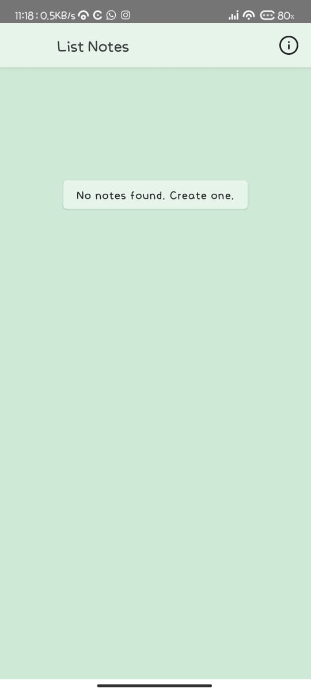
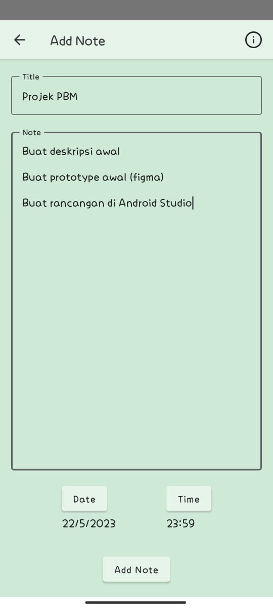
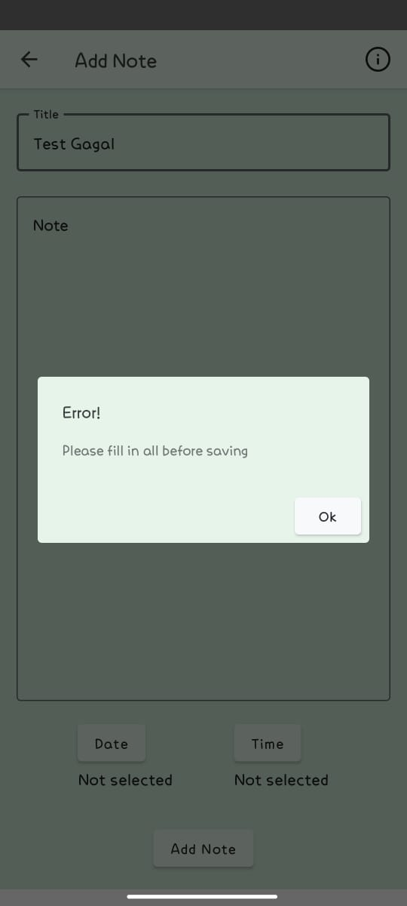
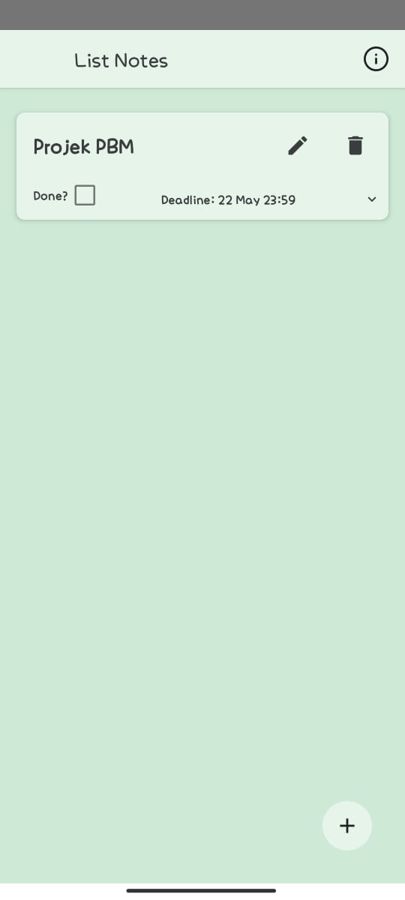
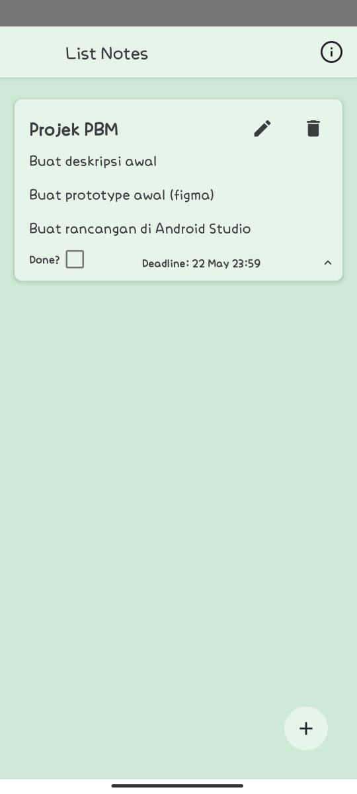
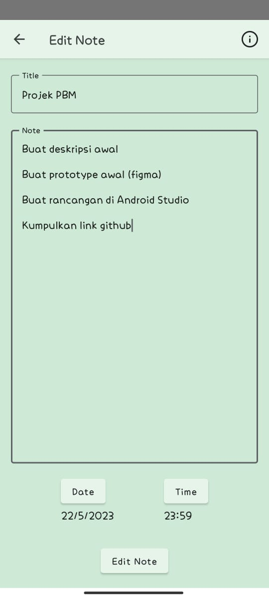
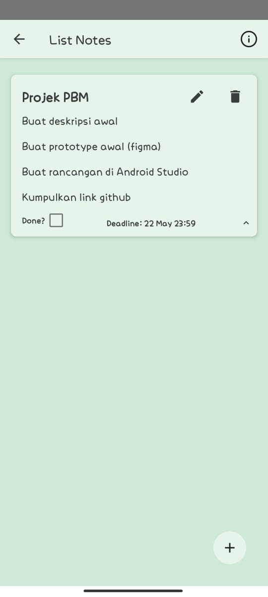
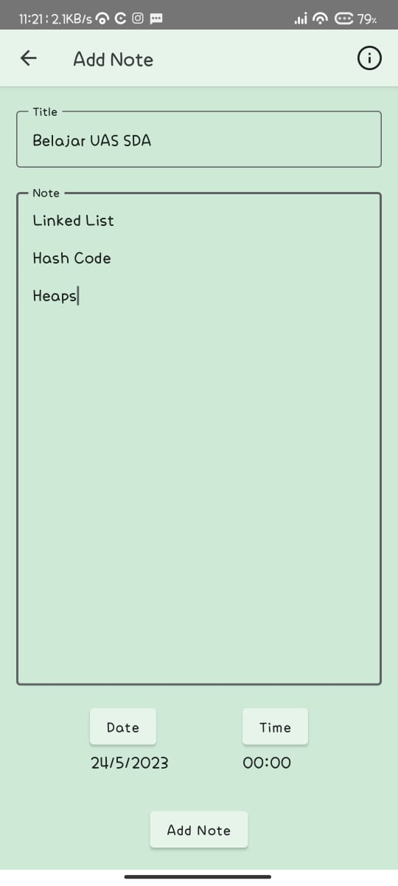
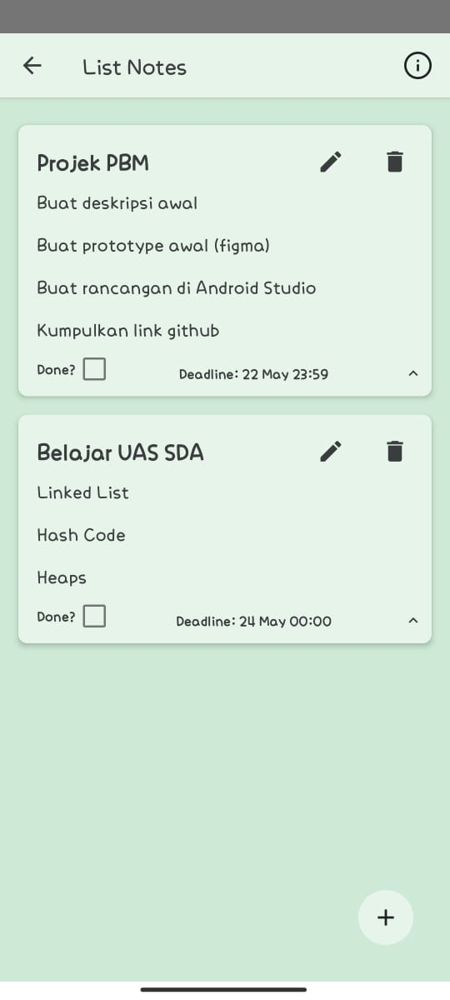

# PBM-FINAL

## Deskripsi Proyek:

Aplikasi penjadwalan tugas harian adalah sebuah aplikasi yang memungkinkan pengguna untuk membuat jadwal tugas harian dan mengatur waktu untuk menyelesaikan tugas tersebut. Aplikasi ini dirancang untuk membantu pengguna meningkatkan produktivitas dan efisiensi dalam mengelola tugas-tugas harian mereka. Aplikasi ini akan memungkinkan pengguna untuk membuat jadwal tugas harian mereka dan menentukan waktu yang dibutuhkan untuk menyelesaikan tugas tersebut. Aplikasi ini akan memiliki kemampuan untuk menambahkan tugas baru, menghapus tugas yang sudah selesai, dan memperbarui waktu yang dibutuhkan untuk menyelesaikan tugas.

## Demo Aplikasi

### Tampilan Awal
Saat aplikasi dibuka pertama kali, akan muncul tampilan seperti dibawah ini, terdapat tombol untuk menambah catatan dikarenakan belum ada catatan yang dibuat

### Tambah Catatan Baru
Saat tombol untuk menambah catatan, muncul tampilan seperti dibawah ini, Terdapat Judul, Deskripsi dan Deadline waktu yang harus diisi saat menambah catatan tersebut

### Tampilan Ketika Berhasil Ditambah
Setelah menekan tombol "Add Note", akan diberitahukan bahwa catatan berhasil ditambahkan

### Tampilan Ketika Gagal Ditambah
Ketika terdapat bagian yang tidak diisi, akan muncul error yang meminta untuk mengisi seluruh bagian

### Tampilan Layar Setelah Ditambah Catatan
Berikut tampilan setelah ditambah catatannya, perhatikan bahwa deskripsi catatan tidak diperlihatkan

### Tampilan Catatan Dengan Deskripsi Catatan
Saat tombol panah ditekan (terletak di bagian kanan-bawah) akan muncul deskripsi dari catatannya

### Tampilan Layar Saat Edit Catatan
Dengan menekan tombol icon pensil pada suatu catatan, kita dapat mengedit catatan tersebut

### Tampilan Setelah Edit Catatan

### Menambah Catatan Baru
Kita dapat menambah catatan-catatan lain, berikut contohnya

### Tampilan Setelah Ditambah Catatan Baru

