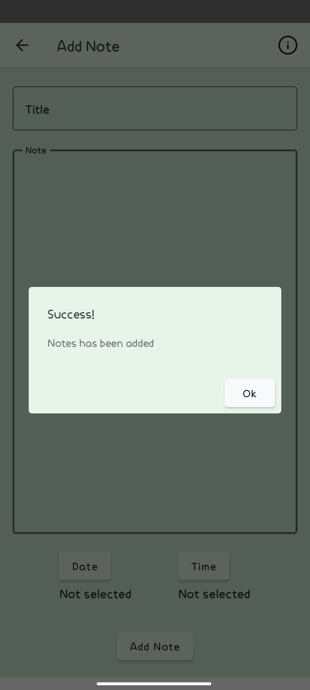

# PBM-FINAL

## Deskripsi Proyek:

Aplikasi penjadwalan tugas harian adalah sebuah aplikasi yang memungkinkan pengguna untuk membuat jadwal tugas harian dan mengatur waktu untuk menyelesaikan tugas tersebut. Aplikasi ini dirancang untuk membantu pengguna meningkatkan produktivitas dan efisiensi dalam mengelola tugas-tugas harian mereka. Aplikasi ini akan memungkinkan pengguna untuk membuat jadwal tugas harian mereka dan menentukan waktu yang dibutuhkan untuk menyelesaikan tugas tersebut. Aplikasi ini akan memiliki kemampuan untuk menambahkan tugas baru, menghapus tugas yang sudah selesai, dan memperbarui waktu yang dibutuhkan untuk menyelesaikan tugas.

## Demo Aplikasi

* Tampilan Awal

* Tambah Catatan Baru

* Tampilan Ketika Berhasil Ditambah

* Tampilan Ketika Gagal Ditambah

* Tampilan Layar Setelah Ditambah Catatan

* Tampilan Catatan Dengan Deskripsi Catatan

* Tampilan Layar Saat Edit Catatan

* Tampilan Setelah Edit Catatan

* Menambah Catata Baru

* Tampilan Setelah Ditambah Catatan Baru

